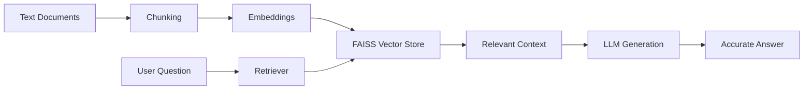

# 🚀 Simple RAG Assistant

### Intelligent Document Question Answering with LangChain, FAISS & Streamlit


---

## 🌟 Overview

**Simple RAG Assistant** is a modern Retrieval-Augmented Generation (RAG) application that transforms static documents into an intelligent AI-powered knowledge assistant.

Instead of generating responses from general knowledge, the assistant retrieves relevant information from your documents and generates context-aware answers, ensuring higher accuracy and reduced hallucinations.

Built with **LangChain**, **FAISS**, **Sentence Transformers**, and **Streamlit**, this project demonstrates the complete RAG workflow in a beginner-friendly yet production-inspired architecture.

---

## 🎥 How It Works



---

## 🧠 What is Retrieval-Augmented Generation (RAG)?

RAG combines the power of:

### 🔍 Retrieval

Searches and retrieves the most relevant information from your documents.

### 🤖 Generation

Uses an AI language model to generate answers based on the retrieved context.

This approach significantly improves reliability by grounding responses in real data instead of relying solely on model memory.

---

## ✨ Key Features

### 📚 Document-Aware Intelligence

Ask questions directly from your custom knowledge base.

### ⚡ Semantic Search

Uses vector embeddings to understand meaning rather than exact keywords.

### 🗂️ FAISS Vector Database

Efficient similarity search for lightning-fast retrieval.

### 🤖 Interactive Chat Assistant

Floating chatbot experience with a clean and modern interface.

### 🔒 Reduced Hallucinations

Answers are generated from retrieved context only.

### 🌐 Streamlit Ready

Deploy instantly on Streamlit Cloud.

### 🆓 Open Source Stack

No paid APIs required.

---

## 🏗️ System Architecture

```text
Document
    │
    ▼
Text Splitter
    │
    ▼
Embedding Model
    │
    ▼
FAISS Vector Store
    │
    ▼
Retriever
    │
    ▼
LLM
    │
    ▼
Generated Answer
```

---

## 🛠️ Technology Stack

| Component       | Technology            |
| --------------- | --------------------- |
| Language        | Python                |
| Framework       | LangChain (LCEL)      |
| Embeddings      | Sentence Transformers |
| Vector Database | FAISS                 |
| Frontend        | Streamlit             |
| LLM             | FLAN-T5               |
| Deployment      | Streamlit Cloud       |

---

## 📂 Project Structure

```bash
simple-rag/
│
├── app.py
├── langchaintesting.txt
├── requirements.txt
└── README.md
```

---

## ⚙️ Installation

### 1️⃣ Clone Repository

```bash
git clone https://github.com/yourusername/simple-rag.git

cd simple-rag
```

### 2️⃣ Install Dependencies

```bash
pip install -r requirements.txt
```

### 3️⃣ Launch Application

```bash
streamlit run app.py
```

---

## 🚀 Usage

1. Start the Streamlit application.
2. Open the browser interface.
3. Click the floating chatbot icon.
4. Ask questions about your document.
5. Receive context-aware AI responses instantly.

---

## 📄 Custom Knowledge Base

The assistant currently uses:

```text
langchaintesting.txt
```

You can replace it with:

* Website Content
* Documentation
* Product Manuals
* FAQs
* Research Notes
* Study Material
* Company Knowledge Base

---

## 🎯 Example Queries

```text
What services does the company provide?

Summarize the document.

Who is the founder?

What are the key features mentioned?
```

---

## ☁️ Deployment

### Deploy on Streamlit Cloud

1. Push project to GitHub
2. Connect repository to Streamlit Cloud
3. Deploy with one click
4. Share your AI assistant globally

---

## 📈 Future Enhancements

* PDF Support
* Multiple Document Uploads
* Chat History Memory
* Hybrid Search
* OpenAI / Claude Integration
* Source Citations
* Authentication System
* Multi-Language Support

---

## 🎓 Learning Outcomes

This project helps developers understand:

* Vector Embeddings
* Semantic Search
* Document Chunking
* Retrieval Pipelines
* LangChain LCEL
* FAISS Indexing
* Streamlit Deployment
* End-to-End RAG Systems

---

## 👨‍💻 Author

### Boppana Chandramouli

AI Engineer • Machine Learning Enthusiast • Generative AI Developer

Focused on building intelligent AI systems, RAG applications, LLM-powered products, and real-world machine learning solutions.

---

## ⭐ Support

If you found this project useful:

⭐ Star the repository

🍴 Fork the project

🚀 Build your own AI assistant

📢 Share it with the community

---

> "Retrieval-Augmented Generation bridges the gap between static knowledge and intelligent conversations."
