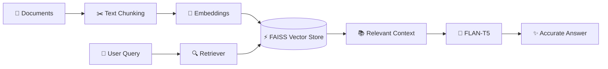
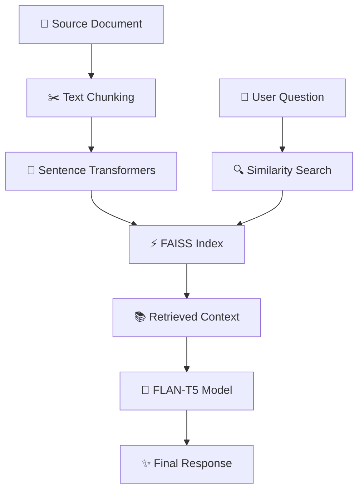

# 🚀 Simple RAG Assistant

<div align="center">


<br>


</div>

---

## 🌟 Overview

**Simple RAG Assistant** is a modern AI-powered document question-answering system built using **LangChain**, **FAISS**, **Sentence Transformers**, and **Streamlit**.

The application transforms static documents into an intelligent conversational assistant capable of understanding user questions, retrieving relevant information, and generating accurate responses grounded in your data.

Unlike traditional chatbots, this system uses **Retrieval-Augmented Generation (RAG)** to reduce hallucinations and provide trustworthy answers directly from your documents.

---

## 🎥 How It Works

<div align="center">


</div>



---

## 🧠 What is RAG?

**RAG = Retrieve + Generate**

### 🔍 Retrieve

Finds the most relevant information from your documents.

### 🤖 Generate

Uses an AI language model to generate answers based on the retrieved content.

### 🎯 Result

More accurate, context-aware responses with significantly fewer hallucinations.

---

## ✨ Features


✅ AI-Powered Document Question Answering

✅ Semantic Search Using Vector Embeddings

✅ FAISS Vector Database Integration

✅ LangChain LCEL Pipeline

✅ Open-Source FLAN-T5 Model

✅ Floating Chatbot Interface

✅ Streamlit Cloud Deployment Ready

✅ Beginner-Friendly Architecture

✅ No Paid APIs Required

---

## ⚙️ Technology Stack

<p align="center">

</p>

| Component       | Technology            |
| --------------- | --------------------- |
| Language        | Python                |
| Framework       | LangChain (LCEL)      |
| Embeddings      | Sentence Transformers |
| Vector Database | FAISS                 |
| Frontend        | Streamlit             |
| LLM             | FLAN-T5               |
| Deployment      | Streamlit Cloud       |

---

## 📂 Project Structure

<div align="center">


</div>

```text
📦 simple-rag
│
├── 📄 app.py
│   ├── Streamlit UI
│   ├── Chatbot Interface
│   └── RAG Pipeline
│
├── 📄 langchaintesting.txt
│   └── Knowledge Base Document
│
├── 📄 requirements.txt
│   └── Project Dependencies
│
├── 📄 README.md
│   └── Documentation
│
└── 📁 assets
    ├── 🖼️ screenshots
    └── 🎥 demo.gif
```

---

## 🔍 File Responsibilities

| File                   | Purpose                                      |
| ---------------------- | -------------------------------------------- |
| `app.py`               | Main Streamlit application and chatbot logic |
| `langchaintesting.txt` | Source document used for retrieval           |
| `requirements.txt`     | Required Python packages                     |
| `README.md`            | Project documentation                        |
| `assets/`              | Screenshots and demo GIFs                    |

---

## ⚡ RAG Processing Pipeline

```text
📄 Document
      ↓
✂️ Chunking
      ↓
🧠 Embeddings
      ↓
⚡ FAISS Storage
      ↓
🔍 Retrieval
      ↓
🤖 FLAN-T5
      ↓
✨ Generated Answer
```



---

## 🚀 Installation

### 1️⃣ Clone Repository

```bash
git clone https://github.com/yourusername/simple-rag.git

cd simple-rag
```

### 2️⃣ Install Dependencies

```bash
pip install -r requirements.txt
```

### 3️⃣ Launch Application

```bash
streamlit run app.py
```

---

## 🎯 Usage

1. Launch the Streamlit application.
2. Open the browser interface.
3. Click the floating chatbot icon.
4. Ask questions about the document.
5. Receive context-aware AI-generated answers.

---

## 📄 Knowledge Source

The assistant currently uses:

```text
langchaintesting.txt
```

You can replace it with:

* 🌐 Website Content
* 📚 Documentation
* 📋 FAQs
* 📖 Study Notes
* 🏢 Company Knowledge Bases
* 📑 Research Papers

---

## 💬 Example Questions

```text
What information is available in the document?

Summarize the content.

What are the key features mentioned?

Explain the main topic in simple words.
```

---

## ☁️ Deployment

### Streamlit Cloud

1. Push repository to GitHub
2. Connect GitHub repository to Streamlit Cloud
3. Deploy with one click
4. Share your AI assistant globally

---

## 📈 Future Enhancements

* 📄 PDF Support
* 📚 Multi-Document Retrieval
* 🧠 Conversation Memory
* 🔗 Source Citations
* 🌍 Multi-Language Support
* 🤖 OpenAI / Claude Integration
* 📊 Analytics Dashboard
* 🔐 User Authentication

---

## 🎓 Learning Outcomes

This project demonstrates:

* Vector Embeddings
* Semantic Search
* FAISS Indexing
* Retrieval Pipelines
* LangChain LCEL
* Prompt Engineering
* Streamlit Deployment
* End-to-End RAG Architecture

---

## 👨‍💻 Author

### Boppana Chandramouli

**AI Engineer • Machine Learning Enthusiast • Generative AI Developer**

Focused on building intelligent AI systems, Retrieval-Augmented Generation applications, AI Agents, LLM-powered products, and real-world machine learning solutions.

---

## ⭐ Support

If you found this project useful:

⭐ Star the Repository

🍴 Fork the Project

🚀 Build Your Own AI Assistant

📢 Share It With the Community

---

<div align="center">


</div>

> **"Retrieval-Augmented Generation bridges the gap between static knowledge and intelligent conversations."**
