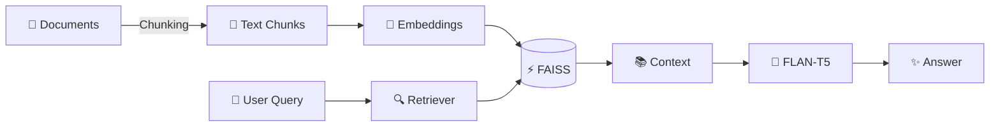

# 🚀 Simple RAG Assistant

<div align="center">


</div>

---

<div align="center">

### ⚡ Live Workflow


</div>

---

## 🎯 Architecture

<div align="center">



</div>

---

## ⚙️ Tech Stack

<p align="center">

</p>

---

## 📊 Project Stats

<p align="center">

</p>

---

## 🔥 RAG Pipeline Animation

<p align="center">

```text
📄 Document
      ↓
✂️ Chunking
      ↓
🧠 Embeddings
      ↓
⚡ FAISS Storage
      ↓
🔍 Retrieval
      ↓
🤖 LLM
      ↓
✨ Accurate Answer
```

</p>

---

## 🌟 Features


✅ Semantic Search

✅ FAISS Vector Database

✅ Context-Aware Responses

✅ Streamlit Chat UI

✅ Beginner Friendly

✅ No API Keys Required

✅ Deployable on Streamlit Cloud

---

<div align="center">

### 🚀 Ask Questions → Retrieve Context → Generate Answers


</div>
