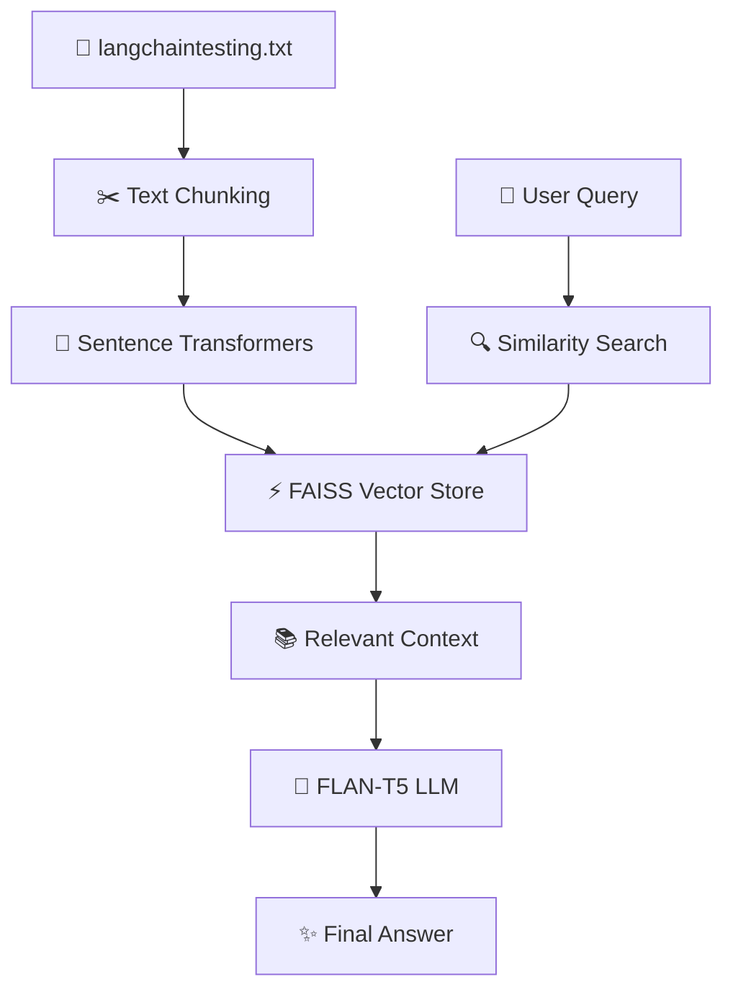

## 📂 Project Structure

<div align="center">


</div>

```text
📦 simple-rag
│
├── 📄 app.py
│   ├── Streamlit User Interface
│   ├── Chatbot Logic
│   └── RAG Pipeline Execution
│
├── 📄 langchaintesting.txt
│   └── Knowledge Base / Source Document
│
├── 📄 requirements.txt
│   └── Project Dependencies
│
├── 📄 README.md
│   └── Project Documentation
│
└── 📁 assets
    ├── 🖼️ screenshots
    └── 🎥 demo.gif
```

---

### 🔍 File Responsibilities

| File                   | Purpose                                          |
| ---------------------- | ------------------------------------------------ |
| `app.py`               | Main Streamlit application and chatbot interface |
| `langchaintesting.txt` | Document used as the knowledge source            |
| `requirements.txt`     | Python package dependencies                      |
| `README.md`            | Project documentation                            |
| `assets/`              | Screenshots, GIFs and project visuals            |

---

### ⚡ RAG Processing Flow



<div align="center">

### 🚀 Simple Yet Powerful Architecture


</div>
